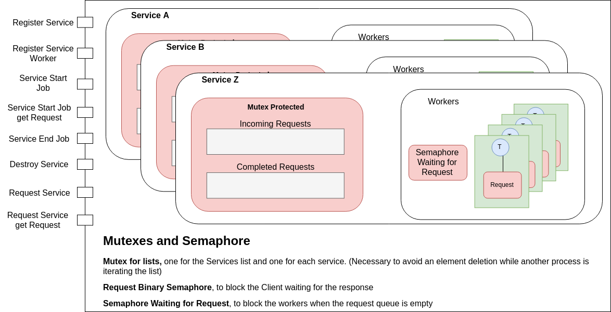
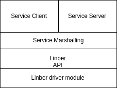
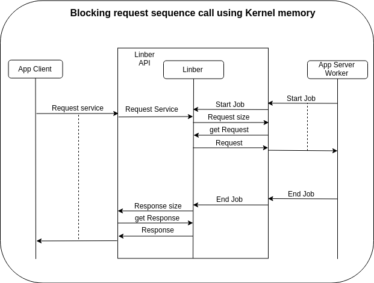

# Linber description
Linber is a RPC mechanism implemented as driver module in the linux kernel.
Linber API uses IOCTL to comunicate with the Linber module through the file /dev/linber \

## 

## Info
### Used environment
Distro: Ubuntu 7.4.0-1ubuntu1~18.04.1	\
Kernel version: 5.0.0-23-generic		\
gcc version 7.4.0

The module uses 0x20 as magic number and [0-10] as sequence number to register the IOCTL operations. (https://elixir.bootlin.com/linux/latest/source/Documentation/ioctl/ioctl-number.txt)

### Dependencies
	sudo apt-get install build-essential make libprotobuf-dev protobuf-compiler

### Execution
	make help						// to see the make options
	make all						// build driver module and tests
	make tests						// compile all tests
	make insmod						// load the module in the kernel
	make rmmod						// remove the module
	make updatemod					// remove, build and reload the module

## Root permissions
In order to set SCHED_DEADLINE as scheduler when required the server must run as root and also the client when server is using the shared memory otherwise the client will not be able to execute shmctl on the share memory created by the server because hasn't the rights to do that.
This is a temporary condition, in order to maintain your brain free of this in the tests' Makefile the compilation is executed as root and the SUID bit is set for the binary files.

## module test using kernel memory to transfer the payload
	//------- service with 1 worker, 5 ms execution time, 100 ms of period and 2 request per period (P=100, Q=2*exec_time) used for SCHED_DEADLINE
	./test/test_service/server org.service 1 5 100 2

	//------- client with 4 concurrent request (threads), delayed on creation by a random value in range [1, 10]ms, with a relative deadline of 1000ms
	// the random delay on creation allow to simulate the general case between periodic and sporadic requests
	./test/test_service/client_blocking org.service 4 10 1000

	//------- same as the latter but this is a non blocking request, the new last parameter is the waiting time before asking for the response
	./test/test_service/client_no_blocking org.service 4 10 1000 100

	//------- run tests starting with a request of 1 byte and double it 20 times so 2^20 = 1MB, each test is executed 1000 times to take the min value
	./test/test_service/client_efficiency_test org.service 1 20	

If the relative deadline is equal to 0 the request will be dispatched only if the incoming queue is empty or there aren't Realtime requets
When a request without Real Time need is dispatched a Best Effor policy is applied to schedule the worker serving that request.
When a Real Time request is dispatched a SCHED_DEADLINE policy is applyied to the serving worker using the Service Period and Budget but setting as deadline the mainimum between the service period and the deadline, if the deadline is expired then the Best Effort policy is used.

## module test using shared memory to transfer the payload

## Efficiency test results
In the x-axis is reported the size of each request used to test the framework, in the y-axis the nanoseconds calculated as the minimum over 1000 iteration with the same request, this is done to minimize the interference coming from other components of the O.S.
The service server used one worker with execution time equal to 0 and SCHED_FIFO with static priority 99 as best effort policy.

The following data have been computed on a:\
	Intel(R) Core(TM) i7-8550U CPU running @[3.8, 4.00]Ghz \
	L1d cache: 32K L1i cache: 32K \
	L2 cache: 256K \
	L3 cache: 8192K

